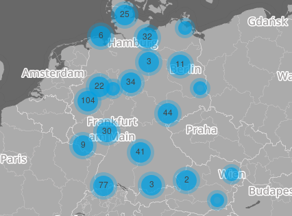

---
title:
- Freifunk - Wir bauen Gemeinschaftsnetze!
author:
- Jasper Orschulko, Anton Müller
theme:
- Freifunk
---

# Was ist Freifunk?
Freifunk ist eine Initiative für freie Funknetzwerke, als Alternative zu kommerziellen Netzwerkanbietern.

Wir verstehen frei als:

- öffentlich und anonym zugänglich
- nicht kommerziell und unzensiert
- im Besitz einer Gemeinschaft und dezentral organisiert

---

# Unsere Ziele
- Aufklärung und Sensibilisierung zum Thema Kommunikations- und Informationsfreiheit
- Verminderung der digitalen Spaltung
- Ungehinderte Verbreitung von Wissen und Ressourcen
- Menschen dazu befähigen, eigene Netze aufzubauen und zu betreiben
- Vorhandene und neue Sozialstrukturen fördern und vernetzen

---

# Freifunk vs. kommerzielle Anbieter

](images/commercial_hotspots.png){width=350px}

---

# Freifunk vs. kommerzielle Anbieter

# Aktueller Status
- 50400 Zugänge in 450 Communities

{width=200px}
