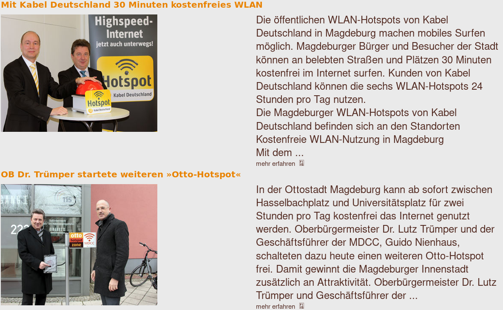
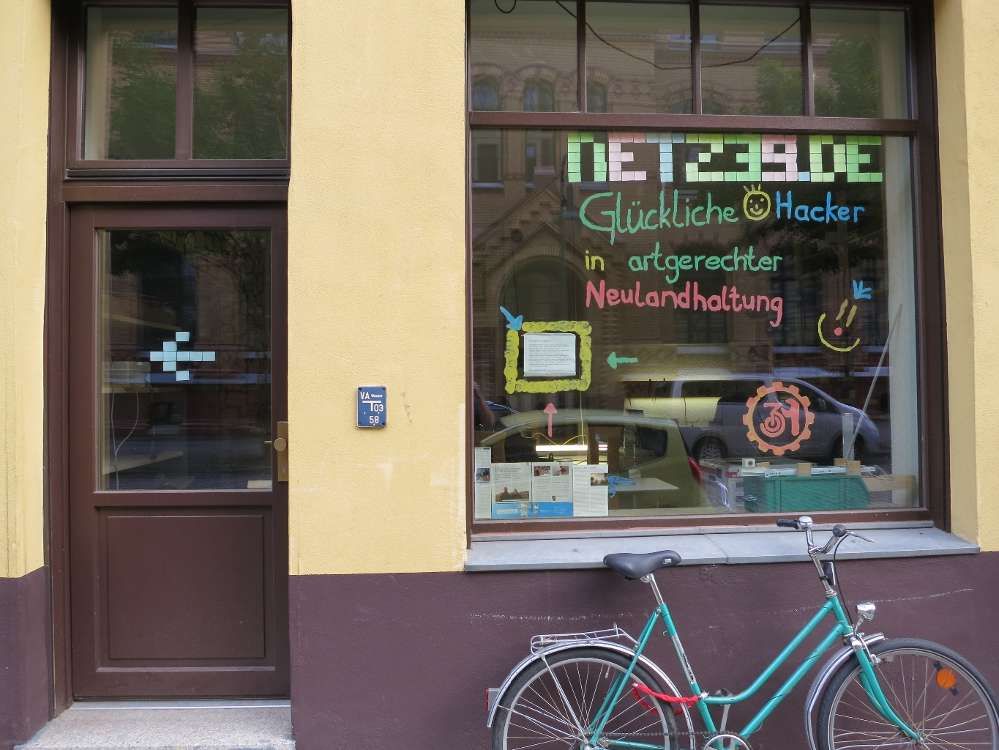
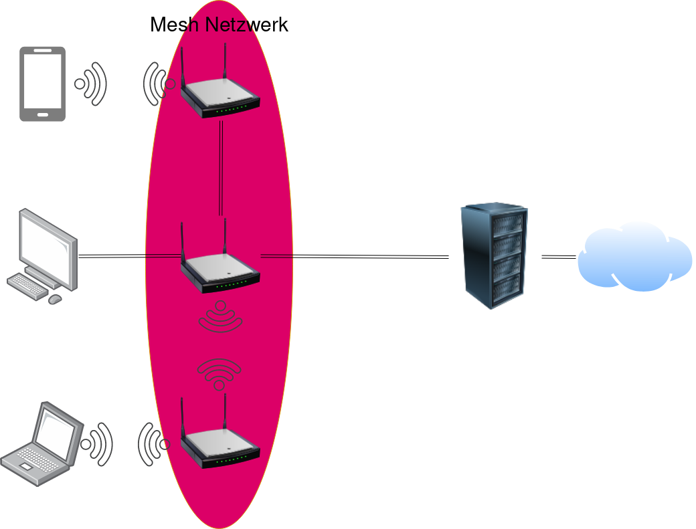
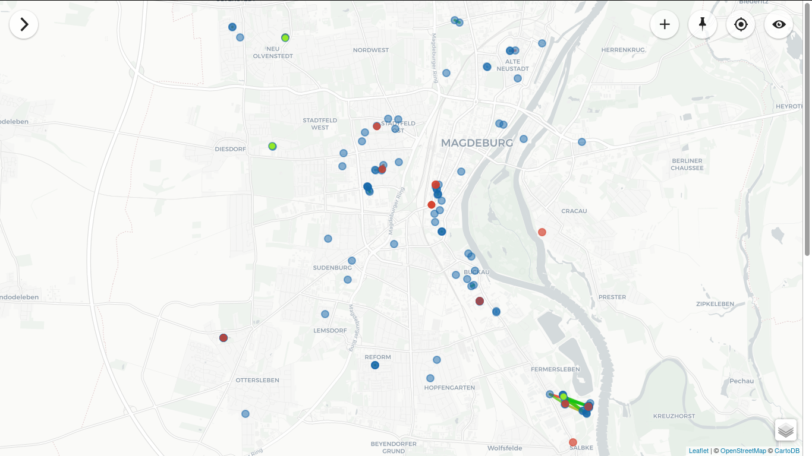
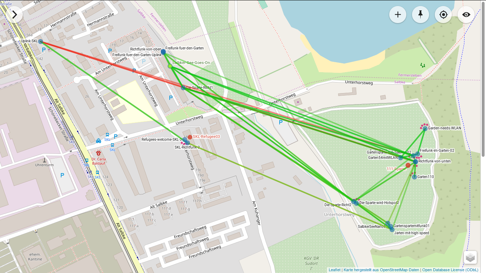
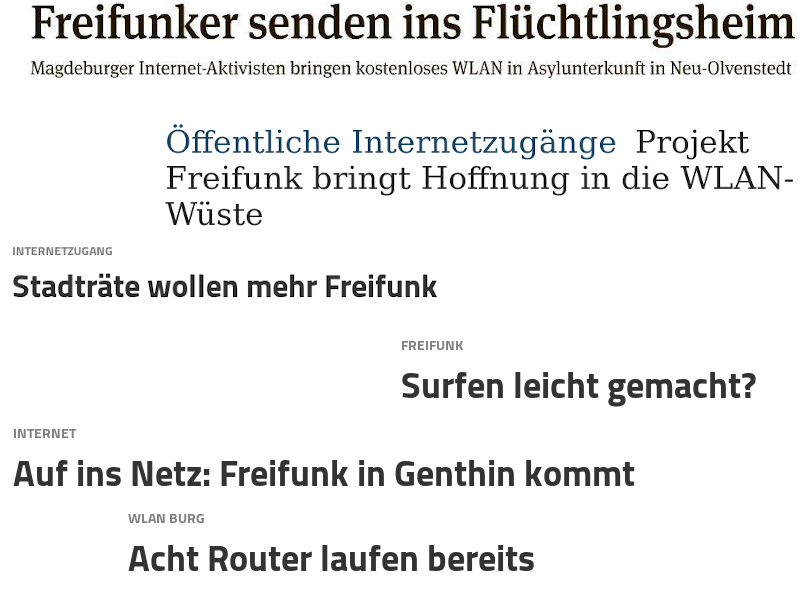
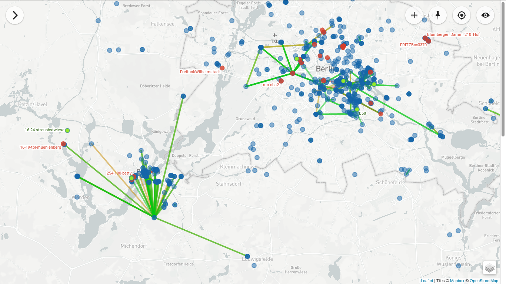

---
title:
- Freifunk - Wir bauen Gemeinschaftsnetze!
author:
- Jasper Orschulko
theme:
- Freifunk
---
# kommerzielle Anbieter (Beispiel Magdeburg)

{width=350px}

# Erstmal eine Fragerunde! :)

# Wer sind wir?
- Netz 39 e.V. ist ein gemeinnütziger Verein in Magdeburg
- Unter Anderem entwickeln und warten wir die Infrastruktur hinter Freifunk MD   
- Wir sind KEINE Hotspot Betreiber!
{width=350px}

# Was ist dieses Freifunk eigentlich?
Freifunk ist eine Initiative für freie Funknetzwerke, als Alternative zu kommerziellen Netzwerkanbietern.

# Was ist dieses Freifunk eigentlich?
Freifunk ist eine Initiative für freie Funknetzwerke, als Alternative zu kommerziellen Netzwerkanbietern.

Wir verstehen frei als:

- öffentlich und anonym zugänglich
- nicht kommerziell und unzensiert
- im Besitz einer Gemeinschaft und dezentral organisiert

# Wie funktioniert Freifunk?
{width=300px}

# Übersicht Freifunk Magdeburg
{width=400px}

# Freifunk Mesh Netzwerk
{width=400px}

# Unsere Ziele
- Verminderung der digitalen Spaltung
- Ungehinderte Verbreitung von Wissen und Ressourcen
- Menschen dazu befähigen, eigene Netze aufzubauen und zu betreiben

# 

# Erfolgreiche Projekte und Presse

# Wie mache ich mit / Wie kann ich helfen?
- Spread the word!
- Stellt euch Zuhause einen Freifunk Router hin!
- Helft mit bei der Entwicklung!

# Demo
[https://md.freifunk.net/mitmachen/firmware/](https://md.freifunk.net/mitmachen/firmware/)

# So findet ihr uns
- Freifunk: [https://freifunk,net/](https://freifunk.net/)
- Freifunk Magdeburg: [https://md.freifunk.net/](https://md.freifunk.net/)

# Danke fürs Zuhören und Mitmachen! :)

# Freifunk Berlin Map

# Datenschutzerklärung MDCC
- "Daten werden automatisch beim Besuch der Website durch unsere IT-Systeme erfasst"
- "Daten können zur Analyse Ihres Nutzerverhaltens verwendet werden"
- "Analyse-Tools und Tools von Drittanbietern: Beim Besuch unserer Website kann Ihr Surf-Verhalten statistisch ausgewertet werden"
- "Der Betreiber speichert entsprechend TKG §113 für 6 Monate die gesetzlich festgelegten Nutzungsdaten" (laut Europäischem Gerichtshof ist TKG §113 illegal)

# Datenschutzerklärung Vodafone
- "Wenn der Gesetzgeber es uns erlaubt, nutzen wir Deine persönlichen Daten auch für neue Zwecke"
- "Deine persönlichen Daten benutzen wir als Grundlage für Big Data-Analysen"
- "(Löschung der) Daten zu Deiner Hotspot- oder Homespot-Nutzung 48 Stunden nach Ende Deiner Internet-Session, alle anderen Internet-Verkehrsdaten spätestens nach 7 Tagen"

# Freifunk vs. kommerzielle Anbieter (Beispiel MD)
- Otto-Hotspot:
    - Zeitlimit von 6 Stunden am Tag
    - Speicherung personenbezogener Daten
    - 18 Hotspots
- Vodafone:
    - Zeitlimit von 30 Minuten am Tag für Nicht-Kunden
    - TODO: AGB
    - 6 Hotspots offiziell gelistet, durch Zwanghotspots vermutlich mehr
